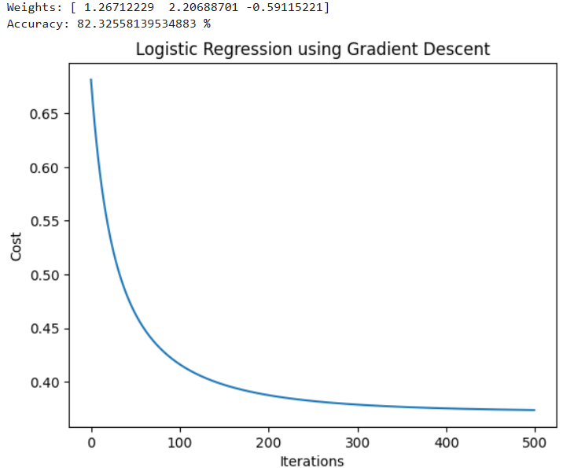

# Implementation-of-Logistic-Regression-Using-Gradient-Descent

## AIM:
To write a program to implement the the Logistic Regression Using Gradient Descent.

## Equipments Required:
1. Hardware – PCs
2. Anaconda – Python 3.7 Installation / Jupyter notebook

## Algorithm
1.Load the placement dataset, convert the target variable (Placed / Not Placed) into binary form, select SSC percentage and MBA percentage as features, and normalize the feature values.

2.Add a bias term to the input data, initialize model parameters (theta), learning rate, and number of iterations.

3.For each iteration, compute predictions using the sigmoid function, calculate the cost function, compute gradients, and update parameters using gradient descent.

4.Predict the placement status, calculate the accuracy of the model, and plot the cost versus iterations graph.
## Program:
```
/*
Program to implement the the Logistic Regression Using Gradient Descent.
Developed by:LATKSHAYA S
RegisterNumber:212225240078
import numpy as np
import pandas as pd
import matplotlib.pyplot as plt
from sklearn.preprocessing import StandardScaler

# Load data
data = pd.read_csv("Placement_Data.csv")

# Convert Placed / Not Placed to 1 / 0
data['status'] = data['status'].map({'Placed': 1, 'Not Placed': 0})

# Take only 2 features (simple)
X = data[['ssc_p', 'mba_p']].values
y = data['status'].values

# -----------------------------
# Standard Scaler (Normalization)
# -----------------------------
scaler = StandardScaler()
X = scaler.fit_transform(X)

# Add bias column (1)
m = len(y)
X = np.c_[np.ones(m), X]

# Sigmoid function
def sigmoid(z):
    return 1 / (1 + np.exp(-z))

# Cost function
def cost_function(X, y, theta):
    h = sigmoid(X @ theta)
    return (-1/m) * np.sum(y*np.log(h) + (1-y)*np.log(1-h))

# Gradient Descent
theta = np.zeros(X.shape[1])
alpha = 0.1
cost_history = []

for i in range(500):
    z = X @ theta
    h = sigmoid(z)
    gradient = (1/m) * X.T @ (h - y)
    theta = theta - alpha * gradient
    
    cost = cost_function(X, y, theta)
    cost_history.append(cost)

# Prediction
y_pred = (sigmoid(X @ theta) >= 0.5).astype(int)

# Accuracy
accuracy = np.mean(y_pred == y) * 100
print("Weights:", theta)
print("Accuracy:", accuracy, "%")

# -----------------------------
# PLOT: Cost vs Iterations
# -----------------------------
plt.figure()
plt.plot(cost_history)
plt.xlabel("Iterations")
plt.ylabel("Cost")
plt.title("Logistic Regression using Gradient Descent")
plt.show()
*/
```

## Output:



## Result:
Thus the program to implement the the Logistic Regression Using Gradient Descent is written and verified using python programming.

